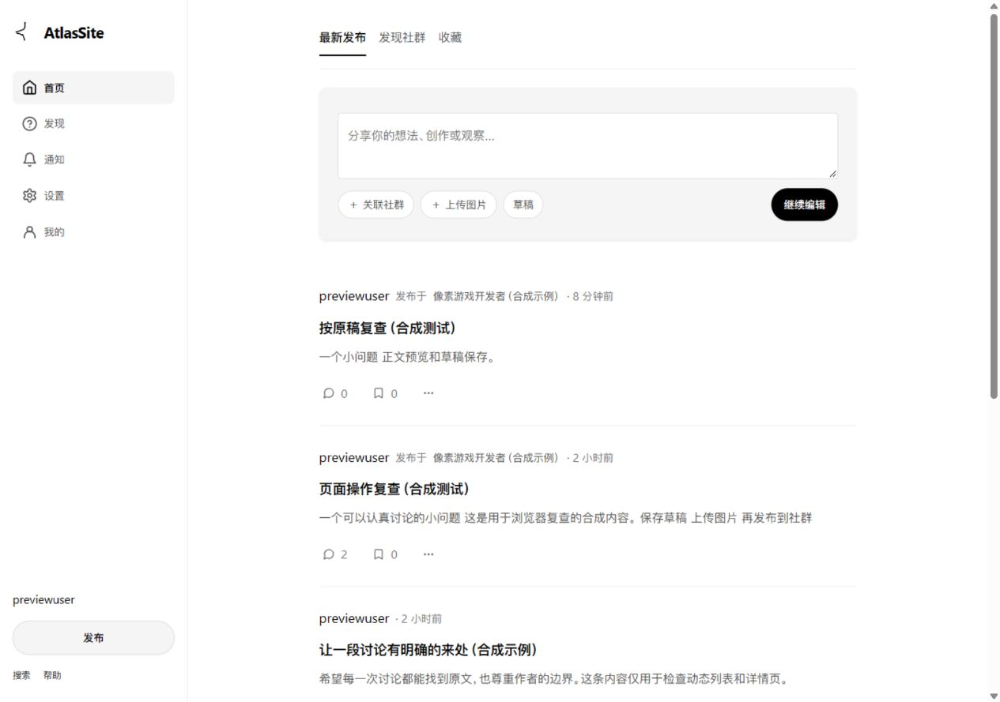
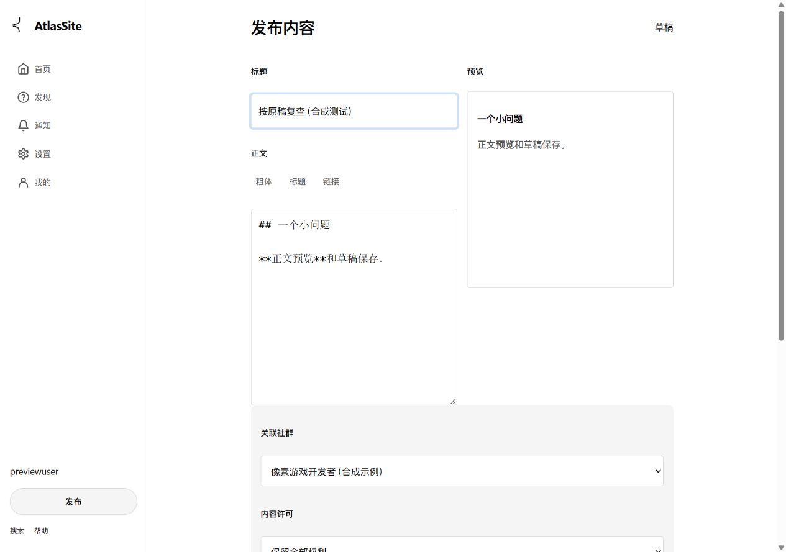
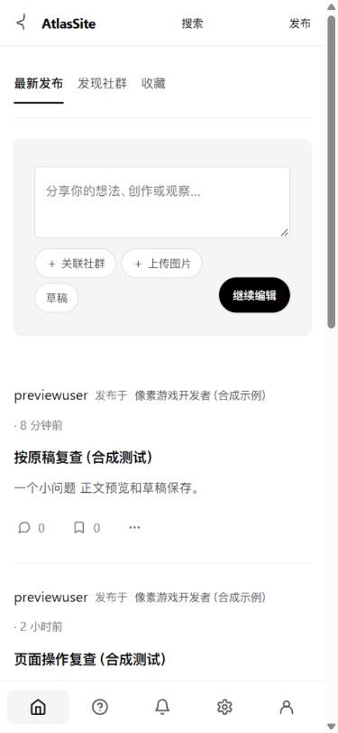
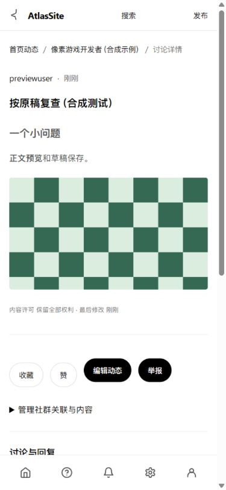

# SAfiles 前端对齐与精简

2026-10-06。按用户指定的 `D:\NewStarProject\SAfiles` HTML 重做真实前端。本记录取代上一版绿色卡片视觉验收；原 UI_REVIEW 仅保留此前功能操作的历史证据。

## 参考与落地

直接使用 atlassite.html 的设计变量、布局、SVG 标志和导航；发现、社群、编辑、详情、个人资料、设置、通知及搜索页的专用样式来自对应 HTML，并限定在各自页面。错误页面沿用原稿的居中状态布局。

- 黑白和灰色为主，蓝色用于链接与焦点；桌面侧栏 240 px，主要内容列上限 720 px。
- 首页采用原稿标签栏、灰色输入区、分隔线内容列表；手机顶部简短入口、底部五项导航。
- 删除英文眉题、重复说明、宣传段落和空状态长文。许可、删除后果及权利说明保留在相关表单或折叠详情。
- 编辑器桌面并排编辑与预览，较窄屏幕切换面板。首页正文进入编辑器时保留，打开编辑器不会直接发布或保存。
- 个人主页直接展示账户服务的公开字段，内容与回复分别切换；搜索类型使用实际筛选链接。
- 社群、草稿、收藏、订阅、通知和设置读取原有真实服务。原稿中尚未实现的投票、Wiki、关注等功能没有加入不可用按钮或虚构人数。
- 新星账户表单同步黑白与蓝色焦点。未新增依赖，未改变数据库 schema。

## 验证

图形浏览器使用独立本地数据库与合成账户，实际完成首页输入传递、Markdown 预览、草稿保存、合成 PNG 上传、手机编辑/预览切换及发布跳转详情。另复查发现、社群、个人内容/回复、搜索及条件保留、通知已读和精简设置。

浏览器复查发现并修复手机网格被后置规则覆盖导致半屏、黑色按钮文字不可见、底部导航缺少可访问名称及首页按钮换行。390 × 844 模拟视口下文档宽度 375 px，内容列使用可用宽度，无横向溢出。模拟视口不代表真实设备验收。

`scripts/check_core.ps1` 已通过两个仓库完整 Go 测试、vet、govulncheck、构建、S03 及核心真实 HTTP 联调。之后的草稿摘要与头像小修重新通过 Atlas 完整 Go 测试、vet 和构建，末尾 CSS 修正经浏览器确认。应用可达漏洞为 0；依赖树仍有当前应用未调用的提示。Windows 未配置 C 工具链，未运行 race。

新增回归验证首页输入安全转义、禁止打开编辑器时发布/保存、CSRF 拒绝和中文长度上限。个人内容与回复分别验证；社群来源状态在真实关于页验证。现有写入、版本和可见性检查保留。

本会话自行检查差异，未进行独立代理审查；本次是本地前端交付，不替代原执行报告的发布条件。

## 查看

- 原开发库及最终页面：星图 http://127.0.0.1:4200/ ，账户 http://127.0.0.1:4100/ 。
- 有内容的隔离预览：星图 http://127.0.0.1:4402/ ，账户 http://127.0.0.1:4401/ 。示例均为合成内容，通过真实页面读写，没有注入原开发库。
- 预览目录为忽略的 `.local/ui-preview-20261006-153046/`。运行元信息位于 `.local/ui-runtime.json` 与 `.local/ui-preview.json`，重启电脑后需重启服务。

桌面首页：

桌面编辑器：

手机首页：

手机详情：

