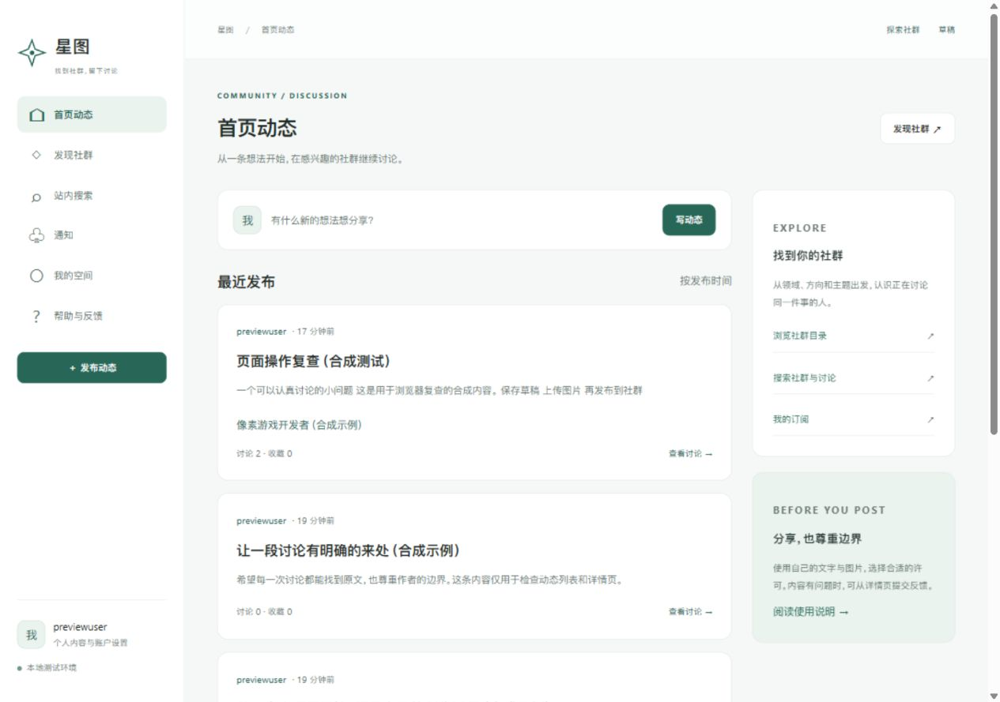
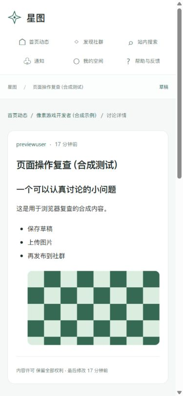

# 真实页面完善与浏览器复查

> 本文的绿色视觉方案已被用户否定并替换。当前前端与截图以 [SAfiles 前端对齐与精简](UI_REFERENCE_2026-10-06.md) 为准；本文保留此前功能验证的历史记录。

2026-10-06。接续核心缺口补齐交付，按用户要求修正页面半成品感、样式和内容入口，并进行图形浏览器复查。本轮修改落在两个服务的实际模板、路由和表单中，页面内容读取实际数据库。

## 页面与内容入口

| 页面 | 实际入口 | 展示及操作 |
| --- | --- | --- |
| 首页与发现 | `/`、`/discover` | 动态卡片、正文摘要、讨论与收藏数量、社群分类目录、发布入口 |
| 社群讨论与主题 | `/c/{slug}`、`/c/{slug}/t/{topic}` | 社群讨论、主题筛选、订阅与通知偏好 |
| 社群公开资料 | `/c/{slug}/announcements`、`/guide`、`/collections`、`/about` | 公告、新人指南、讨论合集、来源与接触方式分别有真实页面；后三个路径均接在 `/c/{slug}` 后 |
| 发布与详情 | `/new`、`/c/{slug}/new`、`/p/{id}`、`/p/{id}/edit` | Markdown 编辑和服务端预览、社群与许可选择、图片上传插入、发布及修改、回复层级 |
| 回复编辑 | `/replies/{id}/edit` | 正文回填、保存、返回原讨论；删除提示独立展开 |
| 我的空间 | `/my` | 本人近期内容、草稿/收藏/订阅/请求数量、账户偏好入口 |
| 私人内容 | `/my/drafts`、`/drafts/{id}`、`/my/bookmarks` | 草稿标题、摘要和保存时间、继续编辑、实际收藏列表 |
| 订阅与通知 | `/my/subscriptions`、`/notifications` | 实际订阅、单一通知偏好勾选项、取消订阅、通知状态与目标链接 |
| 个人资料与搜索 | `/u/{id}`、`/search` | 公开资料、本人活动、搜索筛选与结果；公开资料在新星账户 `/profile` 编辑 |
| 偏好与权利 | `/settings`、`/settings/blocks`、`/settings/account`、`/my/export`、`/security`、`/recover` | 隐私、屏蔽、注销、导出、安全和恢复分别有页面；敏感操作仍要求重新验证身份 |
| 帮助与请求 | `/help`、`/help/report`、`/help/emergency`、`/my/cases`、`/my/cases/{id}` | 使用与权利说明、关联内容举报、受理反馈、期限、状态和申诉 |

## 样式与交互修正

- 星图使用统一页面布局、同源样式表和脚本。导航、标题、按钮、面板、表单、Markdown 正文和空状态遵循同一套样式；新星账户同步色彩与表单视觉。
- 修复全局输入框规则误用于复选框的宽度问题。手机端显示全部主要导航，表单、图片和回复层级可随宽度收缩。
- 浏览器发现手机布局网格的默认最小宽度造成约 608 px 横向溢出，修改为可收缩列，并给导航和侧栏设置最小宽度。最终 390 px 视口下，长内容详情的文档宽度为 375 px，没有横向溢出。
- 动态卡片提取 Markdown 可见文字，移除原始标记、媒体路径和链接地址。详情保留完整 Markdown 排版和图片。
- 图片上传保留在当前编辑器，插入正文并显示缩略图与结果。私人草稿提供自动/手动保存状态；发布与回复失败会保留当前输入并显示错误。
- 回复通过实际回复按钮选择对象并显示作者提示；移除手填回复 UUID 的表单。社群和许可改为实际可用选项。
- 其他作者无法看到管理社群关联的表单。隐私偏好页不再混入注销表单；注销和删除提示在各自页面显示。
- 举报从详情页自动关联，帮助页支持粘贴站内内容链接。已登录浏览器提交成功后跳转请求详情，显示受理反馈；API 原有状态契约保留。
- 浏览器访问错误得到带恢复入口的 HTML 页面，API 请求继续返回原有 JSON 与 HTTP 状态。

## 图形浏览器实际复查

使用 Codex 内置浏览器，桌面视口 1280 × 900、手机视口 390 × 844。浏览器测试使用独立数据库、合成身份、合成文字和本地生成的图片。

已实际执行并看到结果：

1. 新星账户 OIDC 登录、确认、回到星图，进入统一样式的安全页面。
2. 发布页填写标题与 Markdown，选择社群，上传本地合成 PNG，看到插入的图片和服务端预览。
3. 保存私人草稿，看到保存时间；发布后进入真实详情页。
4. 提交一层回复，再通过回复按钮选择对象，提交第二层回复，看到层级与回到父回复的链接。
5. 隐藏社群关系并保存，重载后勾选状态保留。
6. 提交合成举报，进入真实请求详情，看到受理提示和期限；通知进入对应请求。
7. 搜索实际内容并保留筛选条件；从星图进入新星账户资料页，资料字段正常显示与回填。
8. 新建另一份私人草稿、保存并进入草稿列表，看到真实标题、摘要和继续编辑入口。

另查看了工作台、社群新人指南、收藏、订阅、通知、导出、注销选择、回复编辑，以及匿名访问日常开发首页。最终订阅表单只保留一处通知勾选项。最终浏览器控制台未记录 warning/error。

浏览器未执行账户注销、永久删除或真实数据导出；对应权限、删除传播、恢复与导出行为由原有 HTTP/Go 回归验证。手机尺寸为浏览器模拟视口，不能记作真实设备验收。

桌面首页：

手机讨论详情：

## 自动化验证

执行 `scripts/check_core.ps1`，包含两个仓库的完整 Go 测试、vet、govulncheck、构建，以及 `test_s03.py` 和 `test_core.py` 的真实 HTTP 联调。图形浏览器步骤独立执行，不由该脚本完成。

新增 UI 回归覆盖浏览器 HTML / API JSON 错误契约、匿名个人页登录跳转、偏好页面分离、其他作者管理入口隐藏、站内举报链接解析及外站链接拒绝、Markdown 摘要不泄露媒体路径。合集回归改在实际公告/指南/合集路径验证，继续覆盖屏蔽与解除关联后的可见性。

未增加依赖，数据库 schema 保持上一轮的 Atlas 6 / Account 5。漏洞扫描未发现应用可达漏洞，依赖树仍存在未由当前应用调用的扫描提示。Windows 环境未配置 C 编译工具链，本轮未运行 race。

## 当前可查看的本地页面

- 日常开发：星图 `http://127.0.0.1:4200/`，新星账户 `http://127.0.0.1:4100/`。已更新运行版本，未注入合成内容到原开发库。
- 隔离预览：星图 `http://127.0.0.1:4402/`，新星账户 `http://127.0.0.1:4401/`。社群、帖子和草稿标注为合成示例；这些数据保存在独立本地库，通过实际页面读写。
- 隔离预览的运行元信息在忽略的 `.local/ui-preview.json`，数据目录在 `.local/ui-preview-20261006-153046/`。这两个服务可继续查看；重启机器后需重新启动对应本地服务。

上一轮核心复查记录中的“未进行图形浏览器”描述对应上一轮交付；本记录补充本轮实际浏览器证据。真实部署、获授权社群示例、独立复核安排和观察期的状态不由本次页面验收替代。
