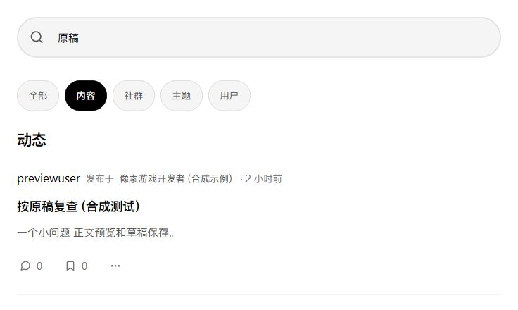
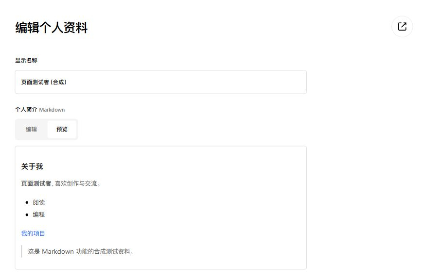

# 搜索与账户简介 Markdown（2026-10-06）

本轮按用户截图修复搜索框，并保持 SAfiles 的简洁黑白界面。

## 实现

- 搜索图标与占位文字重叠源于通用输入框规则覆盖搜索框左内边距。提高专用规则的选择器优先级，保留 56 px 左内边距。
- 将放大镜改为搜索框内的真实提交按钮，去掉外侧重复文字按钮；按钮有可访问名称和提示，点击与回车均提交当前关键词和类型。
- StarAccount 的个人简介支持 Markdown 编辑、服务端预览、保存及原文回填。查看公开资料使用图标入口；保存后在当前页面显示简短状态。
- 账户公开资料和星图个人主页使用同样的简介排版，包括标题、粗体、列表、链接、引用、代码、表格、删除线和脚注。姓名、所在地、网站保持各自字段。
- 简介沿用 2000 个 Unicode 字符上限。仅资料保存和预览端点的请求体上限调整至 32 KiB，以容纳 URL 编码后的中文；其他端点仍为 8 KiB。预览要求登录和 CSRF，不修改数据库。
- 账户引入与星图一致的 Goldmark 1.7.17。默认禁用原始 HTML 和危险链接，简介不加载图片；脚本及预览请求仅允许同源。数据库 schema 未变。

## 验证

`pwsh -NoProfile -File scripts/check_core.ps1` 全部通过：两个仓库完整 Go 测试、vet、govulncheck、构建、S03 登录联调及核心真实 HTTP 联调。应用可达漏洞为 0；依赖树仍有未调用提示。未运行 race。

新增测试覆盖登录与 CSRF 拒绝、预览不写库、Markdown 原文保存和回填、公开页排版、恶意 HTML/链接/图片、2000 个中文字符通过与 2001 个拒绝。双服务 HTTP 测试验证账户保存后的简介通过现有资料 API 在星图两个公开路由渲染。

浏览器在隔离数据库中实际完成图标搜索、回车搜索、条件保留、简介预览与保存、公开资料跳转、原文回填和星图同步展示。桌面 1280 px、手机 390 × 844 复查，无横向溢出，控制台无应用错误。最后手机简介对齐修正重新构建并经浏览器确认。

本会话自行检查差异，未进行独立代理复核。

## 查看

原开发地址已运行当前版本：星图 http://127.0.0.1:4200/search ，账户 http://127.0.0.1:4100/profile 。

截图来自隔离预览 http://127.0.0.1:4402/ 与 http://127.0.0.1:4401/ ，所有示例均为合成内容，没有写入原开发库。运行元信息位于忽略提交的 `.local/ui-runtime.json` 与 `.local/ui-preview.json`，重启电脑后需重启服务。

其他证据：[桌面搜索](ui/search-icons-desktop.jpg)、[手机搜索](ui/search-icons-mobile.jpg)、[桌面资料编辑](ui/account-markdown-editor.jpg)、[手机账户公开资料](ui/account-markdown-mobile.jpg)、[手机星图公开资料](ui/atlas-markdown-mobile.jpg)。
